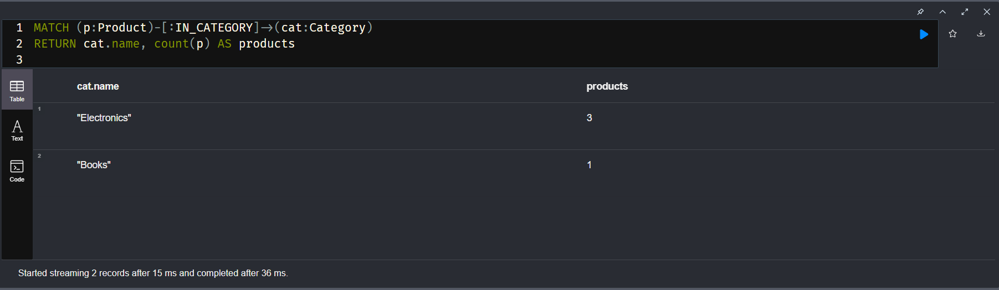

# E-Commerce Knowledge Graph

A Docker-based stack that migrates e-commerce data from PostgreSQL to Neo4j, creating a knowledge graph for product recommendations and customer insights.

## Architecture

```
PostgreSQL (relational data) → ETL Script → Neo4j (graph database) → FastAPI (recommendations)
```

## Quick Start

**1. Start the stack:**
```bash
docker compose up --build -d
```

**2. Verify services:**
```bash
# Check health endpoint
curl http://localhost:8000/health

# View logs
docker compose logs -f
```

**3. Run ETL:**
```bash
# Via API
curl -X POST http://localhost:8000/etl/run

# Or directly
docker compose exec app python /work/app/etl.py
```

**4. Explore the graph:**
- Open [Neo4j Browser](http://localhost:7474)
- Login: `neo4j` / `password`
- Try: `MATCH (c:Customer)-[:PLACED]->(o:Order) RETURN c, o`

## Project Structure

```
.
├── docker-compose.yml          # Orchestrates 3 services
├── app/
│   ├── main.py                 # FastAPI endpoints
│   ├── etl.py                  # ETL logic (Postgres → Neo4j)
│   ├── queries.cypher          # Neo4j schema
│   ├── requirements.txt        # Python dependencies
│   ├── dockerfile              # App container
│   └── start.sh                # Uvicorn startup
├── postgres/
│   ├── 01_schema.sql           # Database schema
│   └── 02_seed.sql             # Sample data
├── scripts/
│   └── check_containers.sh     # End-to-end validation
└── README.md
```

## The Graph Model

Our ETL creates these nodes and relationships:

- **Nodes:** `Customer`, `Product`, `Category`, `Order`
- **Relationships:**
  - `(Customer)-[:PLACED]->(Order)`
  - `(Order)-[:CONTAINS {quantity}]->(Product)`
  - `(Product)-[:IN_CATEGORY]->(Category)`
  - `(Customer)-[:VIEWED|CLICKED|ADDED_TO_CART]->(Product)` (from events)

## API Endpoints

- `GET /health` - Health check
- `POST /etl/run` - Trigger ETL process

## Environment Variables

Override Neo4j connection via:
- `NEO4J_URI` (default: `bolt://neo4j:7687`)
- `NEO4J_USER` (default: `neo4j`)
- `NEO4J_PASSWORD` (default: `password`)

## Screenshots

### Neo4j Constraints


### Query 1: Customer Orders
```cypher
MATCH (c:Customer)-[:PLACED]->(o:Order)
RETURN c.name, count(o) AS orders
ORDER BY orders DESC
```


### Query 2: Product Categories
```cypher
MATCH (p:Product)-[:IN_CATEGORY]->(cat:Category)
RETURN cat.name, count(p) AS products
```


### Query 3: Customer Behavior
```cypher
MATCH (c:Customer)-[e]->(p:Product)
WHERE type(e) IN ['VIEWED', 'CLICKED', 'ADDED_TO_CART']
RETURN c.name, type(e) AS action, p.name
LIMIT 10
```


### Collab Check
```bash
$ curl http://localhost:8000/recs/collaborative/C1
```


## Recommendation Strategies

This knowledge graph enables several recommendation approaches:

1. **Collaborative Filtering:** Find customers with similar purchase patterns via `(Customer)-[:PLACED]->(:Order)-[:CONTAINS]->(:Product)` paths, then recommend products they bought but the target user hasn't.

2. **Co-occurrence:** Products frequently bought together using `MATCH (p1)<-[:CONTAINS]-(:Order)-[:CONTAINS]->(p2)` to find product pairs.

3. **Category-based:** Recommend products from categories the customer previously purchased from.

4. **Behavioral signals:** Leverage `VIEWED`, `CLICKED`, `ADDED_TO_CART` events to understand customer intent and recommend products with similar interaction patterns.

## Production Improvements

To make this production-ready:

- **Scalability:** Batch ETL operations using Neo4j's bulk import and process data in chunks instead of row-by-row iterations.
- **Error handling:** Add retry logic, transaction management, and comprehensive logging with metrics tracking.
- **Security:** Use secrets management (Vault/AWS Secrets Manager), implement API authentication, and network isolation.
- **Monitoring:** Add Prometheus metrics, health checks with detailed status, and alerting for ETL failures.
- **Testing:** Unit tests for transformations, integration tests with test containers, and CI/CD pipelines.
- **Configuration:** Environment-specific configs, feature flags, and centralized configuration management.
- **Data quality:** Add validation rules, data lineage tracking, and incremental ETL with change detection.

## Troubleshooting

**Containers not starting?**
```bash
docker compose ps
docker compose logs app postgres neo4j
```

**Connection errors?**
- Verify credentials in `docker-compose.yml`
- Check Neo4j is ready: `docker compose logs neo4j | grep "Started"`
- Ensure ports 5432, 7474, 7687, 8000 aren't in use

**ETL fails?**
```bash
# Check Postgres data
docker compose exec postgres psql -U app -d shop -c "SELECT count(*) FROM customers;"

# Verify Neo4j connection
docker compose exec app python -c "from neo4j import GraphDatabase; print('OK')"
```